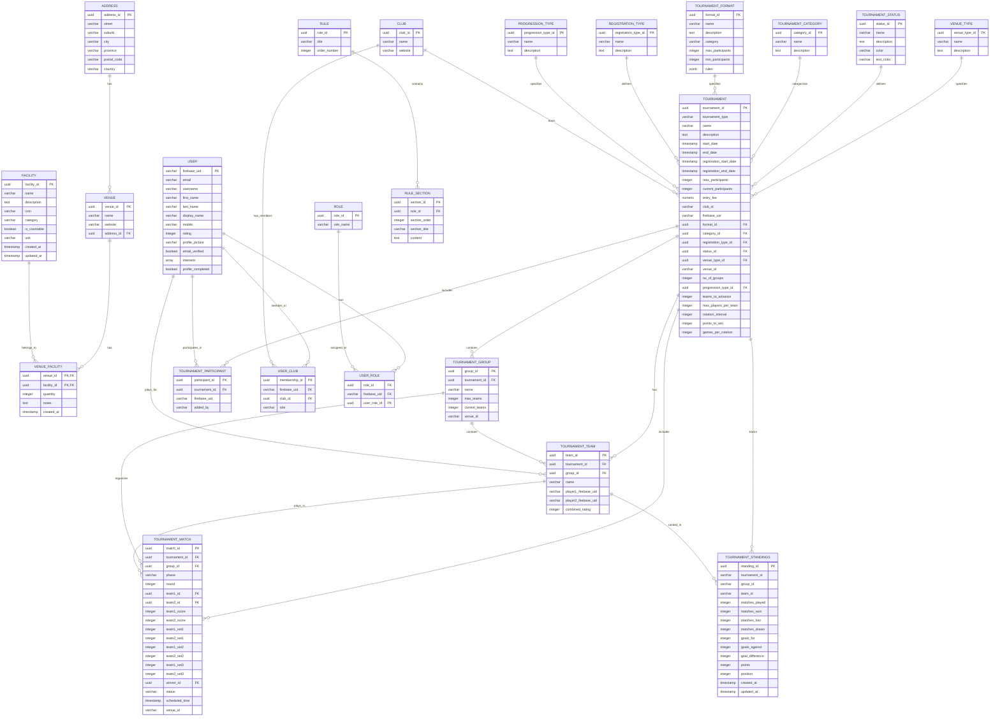

# Core Padel Database - Entity Relationship Diagram

This document contains the complete Entity Relationship (ER) Diagram for the Core Padel application database, showing all 23 tables and their relationships in the `core` schema.

## Database Schema Overview

The database is organized into several logical groups:
- **Venue Management**: Venues, addresses, facilities, and venue types
- **Tournament Management**: Tournaments, teams, matches, participants, and standings
- **User Management**: Users, clubs, roles, and memberships
- **Rules System**: Padel rules and rule sections

## ER Diagram (Mermaid)

## Table Descriptions

### Venue Management (5 tables)
- **ADDRESS**: Stores physical address information for venues
- **VENUE**: Represents padel clubs/venues with their basic information
- **VENUE_TYPE**: Defines types of venues (single, multiple, etc.)
- **FACILITY**: Individual facilities that can be associated with venues
- **VENUE_FACILITY**: Junction table linking venues to facilities with quantities

### Tournament Management (11 tables)
- **TOURNAMENT**: Main tournament entity with all configuration options
- **TOURNAMENT_STATUS**: Tournament lifecycle statuses (draft, active, completed, etc.)
- **TOURNAMENT_CATEGORY**: Tournament categories (men's, women's, mixed)
- **TOURNAMENT_FORMAT**: Tournament formats (round-robin, single elimination, etc.)
- **REGISTRATION_TYPE**: How players register (individual, team, solo)
- **PROGRESSION_TYPE**: How players advance through the tournament
- **TOURNAMENT_GROUP**: Groups within tournaments for organization
- **TOURNAMENT_TEAM**: Teams participating in tournaments
- **TOURNAMENT_MATCH**: Individual matches between teams
- **TOURNAMENT_PARTICIPANT**: Players registered for tournaments
- **TOURNAMENT_STANDINGS**: Current rankings and statistics

### User Management (5 tables)
- **USER**: User profiles with Firebase authentication
- **CLUB**: Padel clubs that users can join
- **USER_CLUB**: Membership relationships between users and clubs
- **ROLE**: System roles for users
- **USER_ROLE**: Role assignments for users

### Rules System (2 tables)
- **RULE**: Padel rules with titles and ordering (29 rules including Basic Padel Rules, Scoring System, Court Dimensions)
- **RULE_SECTION**: Individual rule sections with content (16 sections for the new consolidated rules)

## Key Relationships

1. **Venues** are linked to **Addresses** (one-to-one)
2. **Venues** can have multiple **Facilities** through the **VENUE_FACILITY** junction table
3. **Tournaments** reference multiple lookup tables for configuration
4. **Tournaments** contain **Groups**, **Teams**, and **Matches**
5. **Users** can belong to multiple **Clubs** and have multiple **Roles**
6. **Rules** contain multiple **Rule Sections**

## Current Data Status

- **Total Tables**: 23 tables in the `core` schema
- **Rules**: 29 padel rules with proper structure
- **Rule Sections**: 16 sections for the consolidated rules (Basic Padel Rules: 6 sections, Scoring System: 5 sections, Court Dimensions: 5 sections)
- **All tables** are now properly consolidated in the `core` schema

## Notes

- The database uses UUID primary keys for most tables
- Firebase UID is used for user authentication
- Timestamps are used for audit trails
- The design supports both individual and team tournaments
- Facilities are normalized to support different venue configurations
- **All rules tables are now properly consolidated in the `core` schema** - no more duplicates in `public` schema
